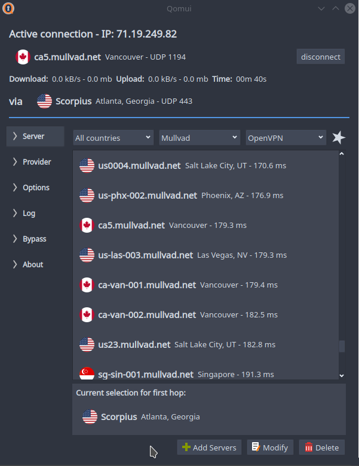
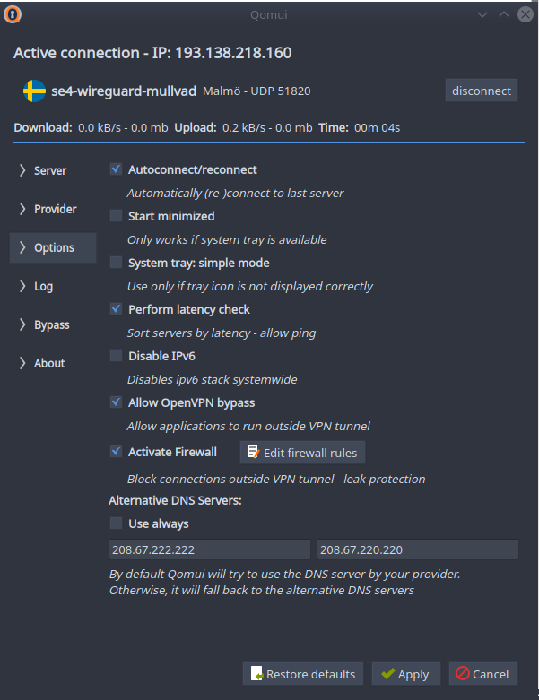
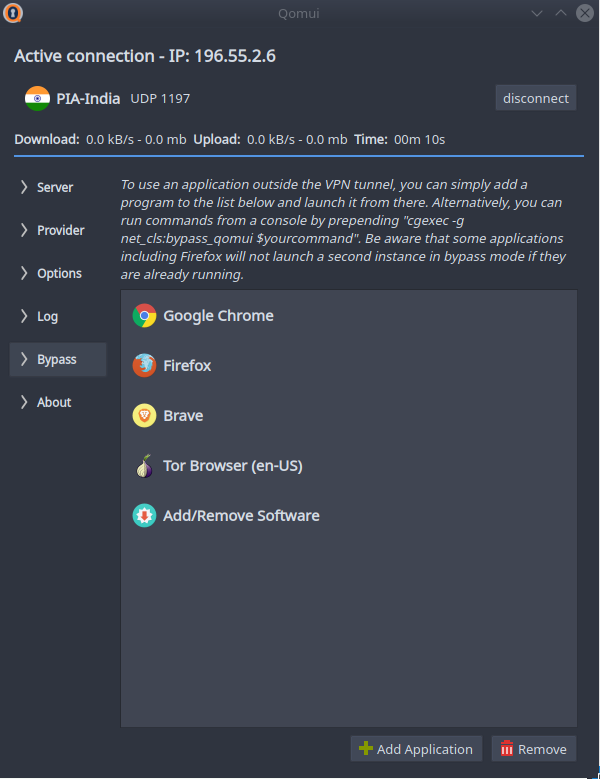

# Qomui  

### Description
Qomui (Qt OpenVPN Management UI) is an easy-to-use OpenVPN/WireGuard gui for GNU/Linux with some unique features such as provider-independent support for double-hop connections. Qomui supports multiple providers with added convenience when using AirVPN, PIA, ProtonVPN, Windscribe or Mullvad. 

### Features
- works with all VPN providers that offer OpenVPN/WireGuard config files
- easy-to-use gui written in PyQt5
- automatic download function for Mullvad, Private Internet Access, Windscribe, ProtonVPN and AirVPN including support for OpenVPN over SSL and SSH for AirVPN and OpenVPN over SSL for Windscribe (Stealth Mode)
- allows double-hop VPN connections (VPN chains) between different providers
- killswitch & leak protection via an iptables-based, configurable firewall that blocks all outgoing network traffic in case the VPN connection breaks down
- provides the possibility to allow applications to bypass the VPN tunnel, open a second VPN tunnel or use the VPN only for specific applications
- supports WireGuard
- command-line interface 
- security-conscious separation of the gui and a D-Bus service that handles commands that require root privileges

### Screenshots
Screenshots were taken on Arch Linux/Plasma Arc Dark Theme - Qomui will adapt to your theme.<br/>

  


### Dependencies/Requirements
- Qomui should work on any GNU/Linux distribution 
- python (>=3.5)
- python-pyqt5, python-dbus, and python-dbus.mainloop.pyqt5
- Additional python packages: psutil, requests, beautifulsoup4, lxml, pexpect
- openvpn, dnsutils and stunnel
- geoip and geoip-database (optional: to identify server locations)
- dnsmasq, libcgroup, libcgroup-tools, iptables >= 1.6 (optional: required for bypassing OpenVPN)
- wireguard-tools, openresolv (optional: wireguard)

### Installation

- Arch Linux users can download Qomui from the AUR. 
- Packages for Fedora, Debian, Ubuntu & OpenSuse are available [here](https://software.opensuse.org//download.html?project=home%3Acorrad1nho&package=qomui).

### General usage
Qomui contains two components: qomui-gui and qomui-service (and qomui-cli: see below). The latter exposes methods via D-Bus and can be controlled via systemd (alternatively you can start it with "sudo qomui-service" - this is not recommended). 

Current configurations for AirVPN, Mullvad, ProtonVPN, PIA and Windscribe can be automatically downloaded via the provider tab. Qomui will update these once a week if you choose to enable the respective setting in the options tab. For all other providers you can conveniently add a config file folder. Qomui will automatically resolve host names, determine the location of servers (using geoip-database) and save your username and password (in a file readable only by root). 

Once you added server configurations, you can browse and filter them in the server tab. Furthermore, you can mark servers as favourites and connect to one of them randomly. To see a list of all favourited servers click on the star in the upper right. There is also an option to create connection profiles in the respective tab. Profiles will select a server automatically based on the criteria you set. Criteria include protocol (OpenVPN or WireGuard), countries, providers and one of the following selection modes:
- ***Random:*** Chooses a random server among all servers matching the profile
- ***Fastest:*** Chooses the fastest server matching the profile based on latency. For this option to work properly the "Perform latency checks" option needs to be ticked.
- ***Fast/Random:*** Chooses a random server among the fastest twenty percent. If you profile includes more than one country, the algorithm also increases the chance to select a server from a different country next. 

### Options
- ***Autoconnect/reconnect:*** Automatically connect to the last server/last profile once a new internet connection has been detected or after the OpenVPN process has died unexpectedly.
- ***Start minimized:*** Hides the application window on startup. This only works if your desktop environment supports tray icons.
- ***Auto-update:*** Updates server configurations for supported providers automatically every five days.
- ***Perform latency check:*** Checks server latency and sorts servers accordingly.
- ***Disable IPv6:*** Completely disables the IPv6 stack systemwide. This is not recommended unless you know what you are doing.
- ***Allow OpenVPN bypass:*** See bypass section below.
- ***Activate Firewall:*** See firewall section below.
- ***Alternative DNS Servers***: Enforces the usage of custom DNS servers instead of those by your provider. The DNS servers set here will also be used for bypass mode if you don't launch a secondary VPN tunnel.

### Firewall (Killswitch)
It is highly recommended to activate the firewall to prevent against ipv6 and DNS leaks. By default, once qomui-service has been started, all internet connectivity outside the VPN tunnel will be blocked whether or not the gui is running. Hence, your system will be always protected if you enable qomui-service via systemd. Depending on your distribution, it might be necessary to disable preinstalled firewall services such as ufw or firewalld to avoid conflicts. Alternatively, the "Edit firewall" dialog in the options tab offers a setting to enable/disable the firewall only if you start/quit the gui. You can also add custom iptables rules there. 

### Double-Hop
To create a "double-hop" simply choose a first server via the "hop"-button before connecting to the second one. You can mix connections to different providers. However, the double-hop feature does not support OpenVPN over SSL/SSH and WireGuard. Also be aware that depending on your choice of servers this feature may drastically reduce the speed of your internet connection and increase your ping. In any case, you will likely have to sacrifice some bandwith. In my opinion, the added benefits of increased privacy, being able to use different providers as entry and exit node and making it more difficult to be tracked are worth it, though. This feature was inspired by suggestions to simply run a second instance of OpenVPN in a virtual machine to create a double-hop. If that is possible, it should be possible to do the same by manipulating the routing table without the need to fire up a VM. Invaluable resources on the topic were [this discussion on the Openvpn forum](https://forums.openvpn.net/viewtopic.php?f=15&t=7483) and [this github repository](https://github.com/TomAshley303/VPN-Chain). 

### Bypass
Qomui includes the option to allow applications such as web browsers to bypass an existing OpenVPN tunnel. This feature is fully compatible with Qomui's firewall activated and double-hop connections. When activated, you can either add and launch applications via the respective tab or via console by issuing your command the following way:

```
cgexec -g net_cls:bypass_qomui $yourcommand
```
The idea is taken from [this post on severfault.com](https://serverfault.com/questions/669430/how-to-bypass-openvpn-per-application/761780#761780). Essentially, running an application outside the OpenVPN tunnel works by putting it in a network control group. This allows classifying and identifying network packets from processes in this cgroup in order to route them differently. Be aware that the implementation of this feature is still experimental. 

The bypass feature also allows you to open a second OpenVPN tunnel (this does currently not work with WireGuard). You can choose any starred servers from a drop-down menu in the bypass tab. Furthermore, it is possible to connect to a server only via bypass, thereby allowing you to use your VPN only for selected applications. OpenVPN in bypass mode is currently limited to ipv4 to prevent leaks. 

**Limitation:** Opening two OpenVPN tunnels using servers from the same provider only works if your provider supports two concurrent connections on different subnets. Airvpn, Windscribe and PIA allow that, Mullvad and ProtonVPN don't. I haven't yet found a way to force this from the client apart from using a different port or protocol on the second connection. 

### WireGuard
You can add WireGuard config files from any provider as easily as OpenVPN files. WireGuard configs for Mullvad are now downloaded automatically alongside their OpenVPN configs as long as WireGuard is installed. If you choose to manually import WireGuard config files, Qomui will automatically recognize the type of file. As of now, WireGuard will not be installed automatically with DEB and RPM packages. You can find the official installation guidelines for different distributions [here](https://www.wireguard.com/install/).

### Cli
The cli interface is still experimental and missing some features, e.g. automatic reconnects. Avoid using the cli and the gui concurrently. 

#### Example usage

Add config files:
```
qomui-cli -a $provider
```
Connect to a server:
```
qomui-cli -c $server
```
Activate options (e.g. firewall):
```
qomui-cli -e firewall
```
List and filter available servers:
```
qomui-cli -l Airvpn "United States"
```
To see all other available options:
```
qomui-cli --help
```

### About this project
Qomui has been my first ever programming experience and a practical challenge for myself to learn a bit of Python. At this stage, Qomui is a beta release at best. So, don't expect it to run flawlessly even though I test every release extensively on different machines. My resources are limited, though. Hence, I'd appreciate any feedback, bug reports and suggestions for new features.

### Changelog

#### version 0.8.2:
- [new] added AzireVPN
- [new] option to specify key for Airvpn
- [change] fast/random option added to profiles
- [change] order of latency checks now based on previous results
- [change] tidied up directory structure
- [change] checks if ipv6 is available
- [change] auto-updates for different providers won't run concurrently
- [change] check if IPv6 is available before setting iptables rules
- [change] don't generate new WireGuard keys on auto-update
- [change] allow importing new servers if firewall is active but VPN is not
- [bugfix] firewall not deactivating after gui exit (if the respective option is set)
- [bugfix] detection of service crashes is not reliable
- [bugfix] Windscribe auto-update fails because of authentication error
- [bugfix] compatibility with older Qt5 versions 
- [bugfix] previous iptables rules not always restored
- [bugfix] crashes if ipv6 stack not available

#### version 0.8.1:
- [change] option to restart qomui-service from gui if it crashes
- [change] added exceptions for all DBus calls
- [change] improved support for non-systemd distributions
- [change] detecting and closing simultaneously running instances
- [bugfix] Airvpn auto-download fixed
